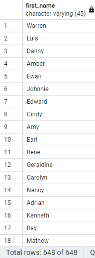
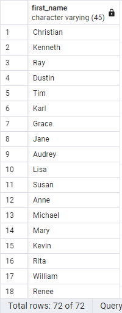
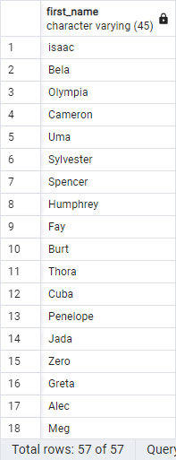
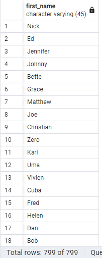
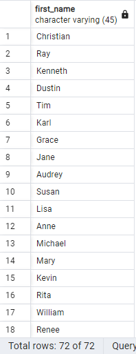
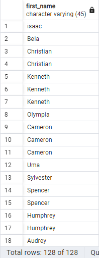

1. (SELECT first_name FROM actor)
   UNION
   (SELECT first_name FROM customer);

   

2. (SELECT first_name FROM actor)
   INTERSECT
   (SELECT first_name FROM customer);

   

3. (SELECT first_name FROM actor)
   EXCEPT
   (SELECT first_name FROM customer);

   

4. - (SELECT first_name FROM actor)
     UNION ALL
     (SELECT first_name FROM customer);

     

   - (SELECT first_name FROM actor)
     INTERSECT ALL
     (SELECT first_name FROM customer);

     

   - (SELECT first_name FROM actor)
     EXCEPT ALL
     (SELECT first_name FROM customer);

     
